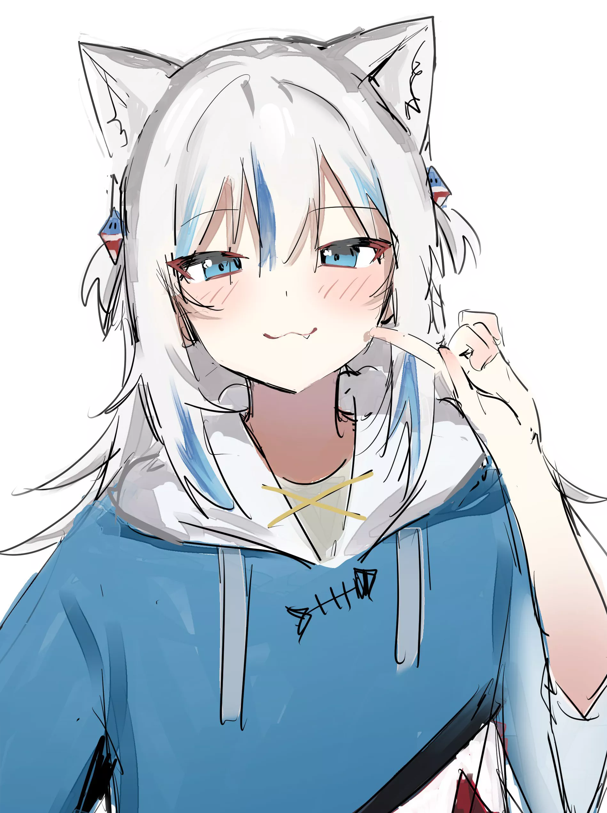
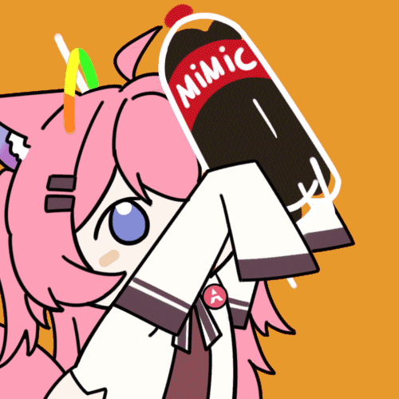

<h1 align="center">~ 💖 𝓗𝓮𝔂 𝓵𝓱𝓮𝓻𝓮 💖 ~</h1>

 

 

 

#### 🌱 𝓐𝓫𝓸𝓾𝓽 𝓶𝓮
- <b>Name:</b> Leever / KPD
- <b>Fursona:</b> Sharky (?)
- <b>Loves:</b> anime, rhythm games
- <b>Yume:</b> be a god of a world like ['Sword Art Online'](https://en.wikipedia.org/wiki/Sword_Art_Online)

 

#### 🤣 𝓚𝓷𝓸𝔀𝓵𝓮𝓭𝓰𝓮
> For a beginner like me, it's a shame to put only a little badge here. any way, it never wrong keep passion in computer

 

#### 💕 𝓒𝓸𝓷𝓽𝓪𝓬𝓽 𝓶𝓮

 
 

